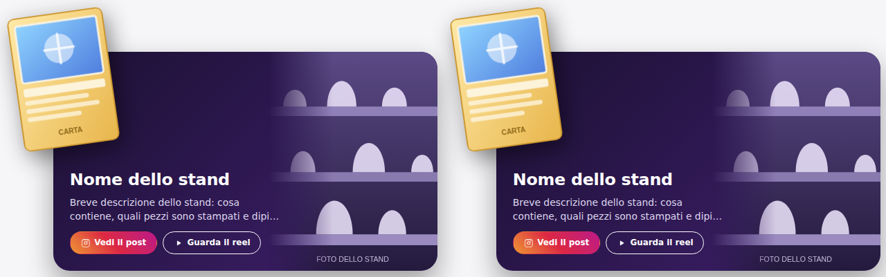

# Francy Stand Flip

Plugin WordPress per FrancyStore3D: mostra gli stand in un **box a dimensione fissa** con la
carta Pokémon che sborda dall'angolo in alto a sinistra, la foto dello stand sul lato opposto,
titolo, breve descrizione e due link Instagram (post e reel).

Si inserisce in qualsiasi pagina — Avada compreso — tramite shortcode.



---

## Installazione

**Zip pronto** (consigliato): scarica
[francy-stand-flip.zip](https://github.com/tarabaz/Francy-stand-flip/releases/latest/download/francy-stand-flip.zip)
dalla release *latest* — lo ricostruisce da solo un workflow ad ogni aggiornamento di `main` —
poi WordPress → Plugin → Aggiungi nuovo → Carica plugin → Installa → Attiva.

**Da sorgente**: il plugin sta nella radice del repository, quindi anche lo zip di GitHub
(pulsante verde *Code → Download ZIP*) è installabile così com'è; l'unica differenza è che la
cartella si chiamerà `Francy-stand-flip-main` invece di `francy-stand-flip`.

> Se avevi installato una versione precedente in cui i file erano annidati in una sottocartella,
> disinstalla il vecchio plugin prima di caricare il nuovo: WordPress lo tratta come un plugin
> diverso e ti ritroveresti due copie attive. Impostazioni e stand **non** si perdono: stanno nel
> database, non nei file.

In bacheca compare il menu **Stand Flip**.

---

## Come si usa

### 1. Creare uno stand

**Stand Flip → Aggiungi stand**. Ogni stand è un "post" con:

| Campo | Note |
|---|---|
| Titolo | è il titolo mostrato nel box |
| Immagine carta Pokémon | PNG con trasparenza consigliato: è quella che sborda |
| Foto dello stand | se la lasci vuota viene usata l'immagine in evidenza |
| Breve descrizione | tenuta corta e troncata a N righe (impostazione globale) per non sballare il box |
| Link al post Instagram | pulsante principale |
| Link al reel Instagram | opzionale: se vuoto il pulsante non appare |
| Aspetto di questo box | override facoltativi di carta, foto dello stand e colore di sfondo |
| Gruppi | tassonomia facoltativa per filtrare la griglia (es. `fiere-2025`) |
| Ordine (Attributi pagina) | numero d'ordine usato dalla griglia |

Nella colonna di destra trovi lo **shortcode pronto da copiare**; lo stesso lo vedi nella lista
di tutti gli stand.

### 2. Inserire i box in una pagina Avada

Nel Fusion Builder aggiungi un elemento **Code Block** (o "Testo") e incolla lo shortcode.

```
[francy_stands]                 griglia con tutti gli stand
[francy_stand id="123"]         un singolo stand
```

### 3. Attributi degli shortcode

`[francy_stands]`

| Attributo | Default | Cosa fa |
|---|---|---|
| `columns` | da impostazioni | colonne su desktop (1–6) |
| `gap` | da impostazioni | spazio tra i box in px |
| `ids` | — | solo questi stand, in quest'ordine: `ids="12,45,9"` |
| `exclude` | — | esclude questi ID |
| `group` | — | filtra per slug del gruppo: `group="fiere-2025"` |
| `limit` | tutti | numero massimo di box |
| `orderby` | `menu_order` | `menu_order`, `date`, `title`, `modified`, `rand` |
| `order` | `ASC` | `ASC` o `DESC` |
| `class` | — | classi CSS extra sul contenitore |

`[francy_stand]` accetta `id`, `slug` e `class`.

Esempi:

```
[francy_stands columns="3" gap="56"]
[francy_stands group="fiere-2025" orderby="date" order="DESC"]
[francy_stand slug="stand-pikachu"]
```

---

## Impostazioni globali

**Stand Flip → Impostazioni**, con **anteprima live** a lato (si aggiorna mentre muovi i valori,
poi salvi).

- **Box**: larghezza massima, altezza, arrotondamento angoli, sfondo pieno o sfumato con angolo,
  bordo, ombra. Più la **larghezza dinamica** (vedi sotto) con la relativa larghezza minima.
- **Carta Pokémon**: coordinate X/Y relative al box (in % o px, valori negativi per far sbordare),
  larghezza, rotazione in gradi, arrotondamento, ombra dedicata con offset/sfocatura/colore/opacità.
- **Immagine stand**: lato (destra/sinistra), larghezza dell'area, `cover`/`contain`, messa a
  fuoco, margine interno, sfumatura di raccordo verso i testi e **foto libera** (vedi sotto).
- **Testi**: padding, larghezza colonna testi, allineamento verticale, dimensioni e colori di
  titolo e descrizione, numero massimo di righe della descrizione.
- **Pulsanti**: stile del pulsante post (**colori Instagram** o personalizzati), dimensione,
  arrotondamento, colori, icona on/off, etichette, target link.
- **Griglia**: colonne desktop/tablet/mobile, gap, margine automatico per ciò che sborda.

### Override per singolo stand

Nella schermata dello stand, sezione *Aspetto di questo box*:

- **carta**: posizione X/Y, larghezza, rotazione;
- **foto dello stand**: posizione e scala — in modalità riquadro i due campi regolano la *messa a
  fuoco* dell'immagine (50/50 = centro, utile quando il soggetto è decentrato), in modalità foto
  libera sono le coordinate assolute;
- **sfondo**: colori dedicati, comodo per abbinare il fondo ai colori della carta.

### Larghezza dinamica

Con la spunta attiva il box non ha più una larghezza massima: occupa tutto lo spazio disponibile
fino a un minimo impostabile. In questa modalità **l'altezza resta fissa** e testi, carta e
padding restano della misura di progetto (non si ingigantiscono): si allarga la foto dello stand.
È la modalità giusta per shortcode messi uno sotto l'altro a tutta pagina.

Con la spunta disattiva vale il comportamento di default: larghezza massima fissa, proporzione
costante e tutto il contenuto che scala insieme al box.

### Foto libera

Con la spunta attiva la foto dello stand non è più ritagliata dentro il riquadro: si posiziona
con coordinate proprie e può sbordare dal box come la carta. Conviene una foto **scontornata in
PNG**. La sfumatura di raccordo non si applica in questa modalità.

---

## Note tecniche

### Ordine dei livelli

Dal basso: sfondo del box → **carta** → **foto dello stand** → testi. La carta sta sempre dietro
la foto (il prodotto è la foto), e i testi sono sempre sopra a tutto.

### Il box resta sempre uguale

Il box ha una proporzione fissa (`aspect-ratio`) e tutto il contenuto è espresso in multipli di
`--fsf-u`, che vale `100cqw / larghezza-box`: testi, padding, ombre e carta scalano insieme al
box, quindi il layout è identico a qualsiasi larghezza. La descrizione è troncata al numero di
righe impostato, così testi più lunghi non allungano il box.

Sotto i ~430px di larghezza del box la divisione testo/immagine non regge: il box passa
automaticamente a layout **impilato** (foto sopra, testi sotto, altezza automatica) con dimensioni
minime di sicurezza per i testi.

### Ciò che sborda non viene mai tagliato

Il contenitore della griglia riceve un **margine automatico** calcolato da posizione, larghezza e
rotazione della carta (e dalla foto, se libera). Per lo stesso motivo lo **spazio tra i box non
scende mai sotto l'ingombro** di quello che esce: senza questo, la carta di un box finirebbe sopra
il box accanto.

Se in Avada la carta risulta comunque tagliata: nelle impostazioni della colonna/contenitore che
ospita lo shortcode metti **Overflow: visible** (il plugin prova già a forzarlo via CSS).

### Temi che sovrascrivono i colori

Avada imposta colore e margini di `h3` e dei link con specificità alta: titolo, descrizione e
pulsanti usano perciò selettori rinforzati e `!important` sulle sole proprietà di colore. Se un
domani un colore non dovesse essere applicato, il punto da guardare è quello.

### Immagini consigliate

- Carta: PNG con trasparenza, lato lungo ~840px (proporzione carta 63×88mm ≈ 1:1,4).
- Foto stand: JPG 1600×1200 circa nella modalità riquadro; PNG scontornato nella modalità libera.
- Il plugin usa `srcset` di WordPress e `loading="lazy"`, quindi non serve caricare file enormi.

### Struttura file

```
francy-stand-flip.php        bootstrap, costanti, attivazione
includes/
├── class-fsf-cpt.php        custom post type "Stand" + tassonomia "Gruppi"
├── class-fsf-settings.php   impostazioni globali, campi, sanitizzazione, pagina admin
├── class-fsf-metabox.php    campi del singolo stand + override + anteprima
├── class-fsf-render.php     variabili CSS e markup del box e della griglia
├── class-fsf-shortcodes.php [francy_stands] e [francy_stand]
└── class-fsf-admin.php      asset backend, colonne lista, link impostazioni
assets/
├── css/front.css            CSS del box (unico file caricato sul sito)
├── css/admin.css            CSS backend
├── js/admin.js              anteprima live, selettore immagini, color picker
└── img/                     segnaposto usati solo nell'anteprima
.github/workflows/           costruisce lo zip installabile ad ogni push su main
```

Il CSS del front-end viene caricato solo dove serve (shortcode presente nel contenuto o
renderizzato da un builder).
